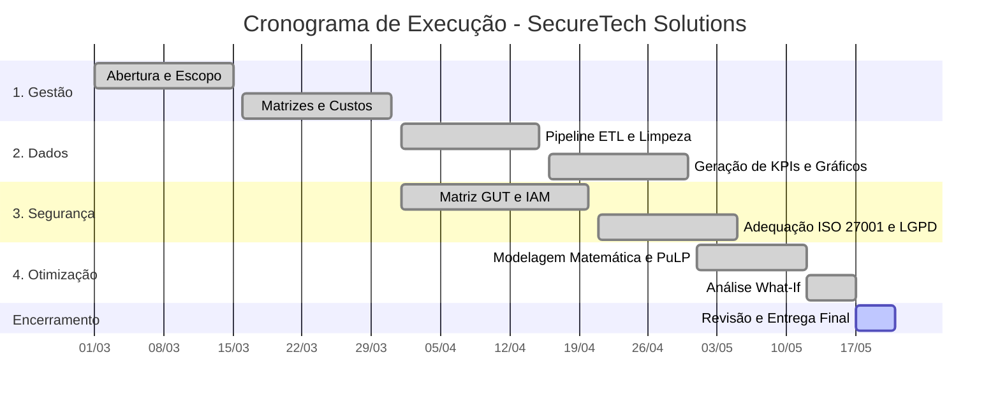

# 📂 1. Gestão de Projetos

A gestão deste projeto foi organizada para garantir a entrega de uma solução completa de segurança para a **SecureTech Solutions**, de forma ágil, clara e estruturada.

---

## 1.1 Termo de Abertura do Projeto (Project Charter)

- **Nome do Projeto:** Implementação da Arquitetura e Dados da SecureTech Solutions.
- **Problema a ser resolvido:** Pequenas e médias empresas (PMEs) não possuem infraestrutura para se proteger contra ameaças cibernéticas e adequar-se à LGPD e à norma ISO 27001, resultando em vazamentos e prejuízos financeiros.
- **Justificativa:** Criar um ambiente integrado (Dados, Segurança e Otimização) permite oferecer segurança corporativa de forma acessível para essas empresas.
- **Objetivos SMART:**
  - **S (Específico):** Desenvolver e simular a infraestrutura de segurança para PMEs.
  - **M (Mensurável):** Implementar painéis de dados com 3 indicadores (KPIs) e adequar 80% dos controles da ISO 27001.
  - **A (Atingível):** Utilizar Python, automação e modelos matemáticos viáveis.
  - **R (Relevante):** Reduzir riscos de ataques e garantir que a empresa siga a LGPD.
  - **T (Temporal):** Concluir o projeto dentro do semestre letivo (Março a Maio de 2026).
- **Premissas e Restrições:**
  - _Premissas:_ A equipe terá disponibilidade parcial. A comunicação será totalmente remota (WhatsApp e Google Meet).
  - _Restrições:_ O orçamento planejado não pode ultrapassar o teto estipulado. O prazo de entrega é fixo e inegociável.

---

## 1.2 Estrutura Analítica do Projeto (EAP / WBS)

A decomposição do trabalho foi dividida nas quatro áreas centrais de entrega:

- **1.0 Gestão do Projeto**
  - 1.1 Documentação e Project Charter
  - 1.2 Backlog e Sprints (Ágil)
  - 1.3 Gestão de Custos e Riscos
- **2.0 Inteligência de Dados (Python)**
  - 2.1 Pipeline ETL (Limpeza e Tratamento)
  - 2.2 Modelagem de KPIs Financeiros
  - 2.3 Visualização de Dados (Data Viz)
- **3.0 Segurança da Informação**
  - 3.1 Mapeamento de Vulnerabilidades (Matriz GUT)
  - 3.2 Políticas de IAM e Zero Trust
  - 3.3 Auditoria de Gaps ISO 27001 e LGPD
- **4.0 Pesquisa Operacional**
  - 4.1 Modelagem de Maximização de Lucro
  - 4.2 Modelagem de Alocação de RH
  - 4.3 Testes e Análises What-If

---

## 1.3 Matriz de Responsabilidades (RACI)

Distribuição de responsabilidades focada na especialização técnica de cada membro: **(R) Responsável** pela execução, **(A) Autoridade** (Aprova), **(C) Consultado** e **(I) Informado**.

| Pacote de Trabalho (EAP)  | Guilherme |  Ricardo  |  Gustavo  | Pedro L. | Lucas A. | Lucas M. | Pedro P. |  Gabriel  | Cauã  |
| :------------------------ | :-------: | :-------: | :-------: | :------: | :------: | :------: | :------: | :-------: | :---: |
| **1.0 Gestão e Projetos** | **R / A** |     I     |     I     |    I     |    I     |  **R**   |    I     |     I     |   C   |
| **2.0 Análise de Dados**  |     I     |     I     | **R / A** |  **R**   |    C     |    I     |  **R**   |     C     |   I   |
| **3.0 Segurança da Info** |     C     | **R / A** |     I     |    C     |  **R**   |    I     |    I     |     I     |   I   |
| **4.0 Modelagem P.O.**    |     C     |     I     |     C     |    I     |    I     |    I     |    C     | **R / A** | **R** |

---

## 1.4 Cronograma e Gráfico de Gantt (Milestones)

Mapeamento visual da execução. Todas as etapas técnicas foram concluídas até o dia 17 de maio, restando apenas a consolidação final.

## 1.5 Gestão de Custos e Orçamento

Abaixo, detalhamos a estimativa orçamentária realista para a implantação da infraestrutura corporativa e operação técnica da SecureTech Solutions, incluindo custos de nuvem, licenciamento e capital humano.

| Item de Custo                       | Qtd / Duração | Valor Unitário  | Total Estimado (R$) |
| :---------------------------------- | :------------ | :-------------- | :------------------ |
| Servidores Cloud (AWS EC2 / S3)     | 6 meses       | R$ 2.500,00/mês | R$ 15.000,00        |
| Licenças (Ferramentas SOC, PowerBI) | 1 pacote      | R$ 12.000,00    | R$ 12.000,00        |
| Consultoria / Auditoria ISO 27001   | 1 serviço     | R$ 35.000,00    | R$ 35.000,00        |
| Horas da Equipa (Mão de Obra)       | 280 horas     | R$ 100,00/hora  | R$ 28.000,00        |
| Reserva de Contingência (15%)       | 1 fundo       | R$ 13.500,00    | R$ 13.500,00        |
| **Budget Operacional Total**        | -             | -               | **R$ 103.500,00**   |

---

## 1.6 Plano de Gerenciamento de Riscos

Mapeamos os principais problemas que poderiam atrasar o projeto e o que faremos para evitar que isso aconteça.

| Problema Identificado                                                      | Chance de Ocorrer | Impacto no Projeto | Ação para Resolver                                                                   |
| :------------------------------------------------------------------------- | :---------------- | :----------------- | :----------------------------------------------------------------------------------- |
| **Mudanças no Escopo** (Pedir coisas novas no meio do caminho)             | Alta              | Alto               | Travar o planejamento. Qualquer mudança nova precisa ser aprovada por todos.         |
| **Falhas de Segurança Críticas** (Achar muitos erros na auditoria)         | Alta              | Alto               | Deixar um tempo extra no cronograma para revisar as regras e políticas.              |
| **Problemas nos Códigos** (Erro na integração entre Python e a Otimização) | Média             | Alto               | Usar o GitHub para revisar o código de cada integrante antes de finalizar.           |
| **Dinheiro Insuficiente** (Ferramentas ficarem mais caras)                 | Média             | Médio              | Priorizar o uso de ferramentas gratuitas (Open Source) que tenham a mesma qualidade. |

---

## 1.7 Plano de Comunicação

Para garantir que todos os 9 membros estejam alinhados sem perder tempo com reuniões desnecessárias, focamos em duas ferramentas:

- **WhatsApp:** Nosso canal principal para conversas diárias, avisos de atualizações no GitHub e dúvidas rápidas.
- **Google Meet:** Reuniões de vídeo para fechamento de etapas, onde compartilhamos a tela para validar os códigos (Python e PuLP) e revisar os documentos finais.

---

## 1.8 Organização das Entregas (Backlog)

O projeto foi dividido em fases de entrega (Sprints) para que o valor fosse gerado de forma contínua:

| ID  | O que deve ser entregue                                                 |   Fase   | Prioridade |
| :-- | :---------------------------------------------------------------------- | :------: | :--------: |
| 01  | Definição de quem faz o quê (RACI) e quanto vai custar o projeto.       | Sprint 1 |    Alta    |
| 02  | Criação da base de dados e dos gráficos de indicadores em Python.       | Sprint 2 |    Alta    |
| 03  | Criação das regras de acesso e das tabelas de riscos de segurança.      | Sprint 3 |    Alta    |
| 04  | Criação dos modelos matemáticos para diminuir custos e aumentar lucros. | Sprint 4 |   Média    |

### ⚠️ Análise Crítica Exigida (Gestão)

**Justificativa dos Custos vs Riscos:** O orçamento de R$ 103.500,00 é realista e foi estrategicamente desenhado para suportar os riscos identificados. A inclusão de uma reserva de contingência de 15% atua diretamente como margem de segurança financeira (buffer) para mitigar o risco de estouro orçamentário caso haja oscilação no valor das licenças ou necessidade de mais horas técnicas.

**Apoio do Framework Ágil:** A adoção do modelo Ágil com entregas divididas em Sprints mitiga diretamente o risco de **"Scope Creep"** (aumento de escopo sem controle). Ao trabalhar com um Backlog priorizado e Sprints fechadas, qualquer pedido de alteração precisa aguardar o próximo ciclo de planejamento, garantindo que a equipe foque 100% na entrega acordada sem estourar o prazo (18 de maio).
