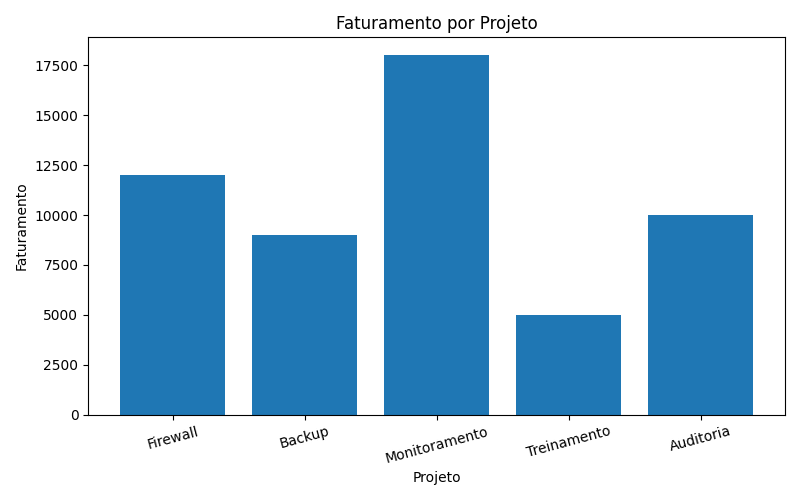

# Análise de Dados

## 2.1 Coleta e Preparação de Dados (ETL)

Nesta etapa, foi criada uma base de dados simulada para representar o funcionamento da empresa SecureTech Solutions. Os dados incluem informações sobre projetos realizados, horas trabalhadas, faturamento e tempo de resposta.

O processo de ETL (Extract, Transform, Load) foi aplicado da seguinte forma:

- Extract (Extração): criação de uma base simulada de projetos.
- Transform (Transformação): organização dos dados em formato estruturado utilizando Python e Pandas.
- Load (Carga): utilização dos dados para análise e geração de indicadores.

---

## 2.2 Base de Dados

| Projeto        | Horas | Faturamento (R$) | Tempo de Resposta (h) |
|----------------|------:|-----------------:|----------------------:|
| Firewall       |   120 |            12000 |                   4.5 |
| Backup         |    80 |             9000 |                   3.2 |
| Monitoramento  |   150 |            18000 |                   5.1 |
| Treinamento    |    60 |             5000 |                   2.8 |
| Auditoria      |    90 |            10000 |                   3.6 |

---

## 2.3 Análise com Python

Foi utilizado Python com as bibliotecas Pandas e Matplotlib para processar os dados e gerar indicadores relevantes.

### Código utilizado

    import pandas as pd
    import matplotlib.pyplot as plt

    dados = {
        "Projeto": ["Firewall", "Backup", "Monitoramento", "Treinamento", "Auditoria"],
        "Horas": [120, 80, 150, 60, 90],
        "Faturamento": [12000, 9000, 18000, 5000, 10000],
        "Tempo_Resposta": [4.5, 3.2, 5.1, 2.8, 3.6]
    }

    df = pd.DataFrame(dados)

    print("Base de dados:")
    print(df)

    print("\nIndicadores:")
    print("Faturamento total:", df["Faturamento"].sum())
    print("Horas totais:", df["Horas"].sum())
    print("Tempo médio de resposta:", round(df["Tempo_Resposta"].mean(), 2))

    plt.figure(figsize=(8, 5))
    plt.bar(df["Projeto"], df["Faturamento"])
    plt.title("Faturamento por Projeto")
    plt.xlabel("Projeto")
    plt.ylabel("Faturamento")
    plt.xticks(rotation=15)
    plt.tight_layout()
    plt.savefig("grafico_faturamento.png")
    plt.show()

---

## 2.4 Visualização de Dados

A seguir, apresenta-se o gráfico gerado a partir da análise dos dados:

O gráfico demonstra a variação de faturamento entre os projetos, evidenciando diferenças no desempenho financeiro e auxiliando na tomada de decisão estratégica.

---

## 2.5 Indicadores Gerados

- Faturamento total: R$ 54.000  
- Horas totais: 500 horas  
- Tempo médio de resposta: 3,84 horas  

---

## 2.6 Análise dos Resultados

A análise dos dados demonstra que a empresa possui boa capacidade de geração de receita, com destaque para o serviço de Monitoramento, que apresenta o maior faturamento entre os projetos analisados.

Por outro lado, esse mesmo serviço apresenta o maior tempo de resposta, indicando maior consumo de recursos operacionais.

Além disso, observa-se que projetos com maior quantidade de horas nem sempre geram maior retorno financeiro, evidenciando a necessidade de otimização de processos.

---

## 2.7 Análise Crítica

Os dados analisados indicam a necessidade de melhorar a eficiência operacional da empresa. Projetos mais longos devem ser reavaliados para garantir melhor relação entre custo e benefício.

A identificação de padrões nos dados permite uma tomada de decisão mais estratégica, contribuindo para a redução de custos e melhoria da qualidade dos serviços.

---

## 2.8 Conclusão da Análise de Dados

A utilização de análise de dados mostrou-se fundamental para compreender o desempenho da empresa, identificar gargalos e apoiar decisões estratégicas.

Com o uso de ferramentas como Python, foi possível transformar dados em informações relevantes, contribuindo diretamente para a eficiência operacional e para a melhoria contínua dos serviços.
